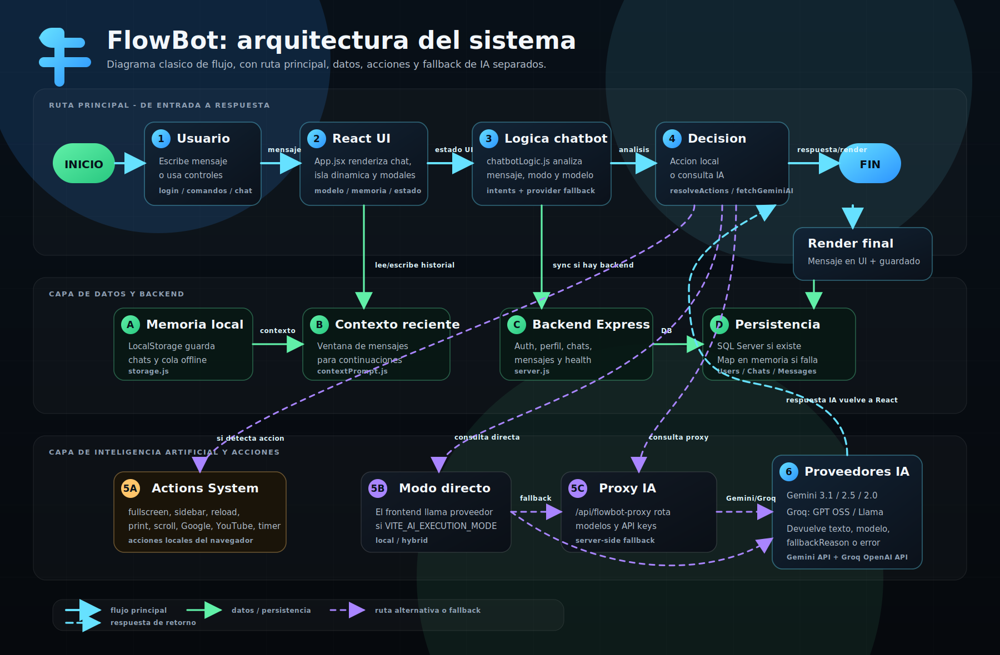

# Arquitectura de FlowBot

Este diagrama muestra el recorrido completo de FlowBot: desde que el usuario escribe un mensaje, pasa por la UI de React, la logica conversacional, la memoria, las acciones del navegador, el backend Express, la persistencia y la capa de IA con fallback entre Gemini y Groq.



## Flujo principal

```mermaid
flowchart LR
    User([Usuario]) -->|Mensaje, login o comando| UI[Frontend React / App.jsx]
    UI --> Logic[chatbotLogic.js]
    UI --> Auth[auth.js]
    UI --> Storage[storage.js]

    Logic --> Context[contextPrompt.js]
    Context --> Logic
    Logic --> Actions[Actions System]
    Actions --> Browser[Sistema / UI del navegador]

    Storage -->|LocalStorage + cola offline| Local[(LocalStorage)]
    Storage -->|Si backend disponible| API[Backend Node / Express]
    Auth -->|register/login/logout/perfil| API

    API --> SQL[(SQL Server)]
    API -->|fallback sin DB| Memory[(Map en memoria)]
    API --> Proxy[/api/flowbot-proxy]

    Logic -->|modo directo si aplica| Gemini[Gemini]
    Logic -->|modo directo si aplica| Groq[Groq]
    Proxy --> Gemini
    Proxy --> Groq

    Gemini --> Logic
    Groq --> Logic
    Proxy --> Logic
    Logic -->|Respuesta, modelo y fallbackReason| UI
    UI -->|Guardar chat/mensaje| Storage
```

## Componentes clave

1. **Frontend React/Vite:** renderiza el chat, la isla dinamica, el sidebar, los modales, el estado de conectividad y los controles de memoria/modelo.
2. **Logica conversacional (`chatbotLogic.js`):** decide proveedor, modelo, modo de pensamiento, fallback, deteccion de intenciones y acciones.
3. **Memoria contextual (`contextPrompt.js`):** construye una ventana reciente para continuaciones, ediciones breves y referencias al historial.
4. **Persistencia (`storage.js`, `auth.js`, backend):** combina LocalStorage, cola offline, API Express, SQL Server y fallback en memoria cuando la base no esta disponible.
5. **Proxy de IA:** centraliza llamadas a Gemini y Groq desde el servidor, rota API keys/modelos y devuelve errores amigables.
6. **Actions System:** ejecuta acciones de navegador como fullscreen, sidebar, reload, print, scroll, busqueda, YouTube y temporizadores.
